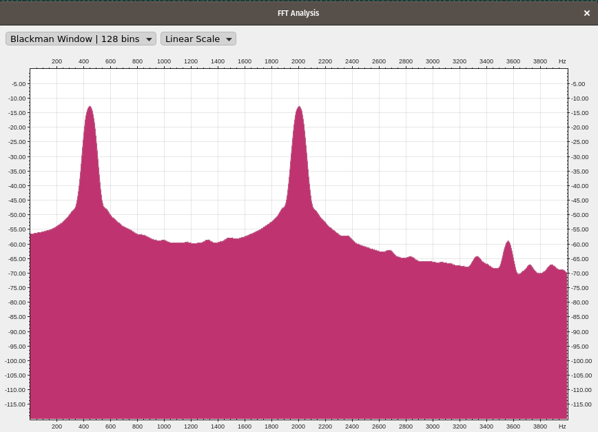
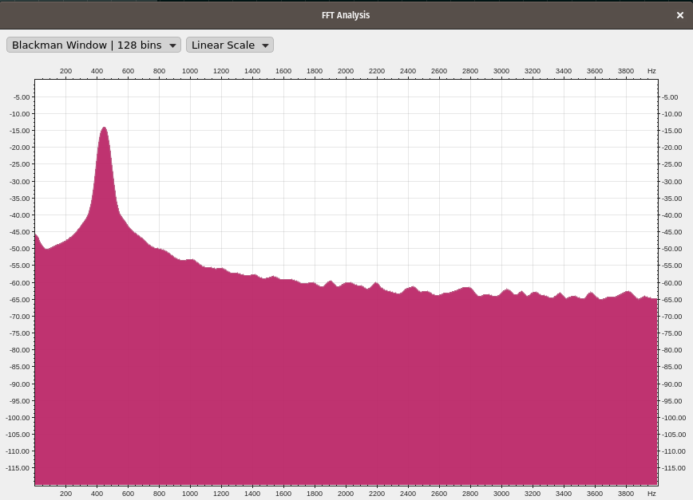

Média móvel com quatro coeficientes
===================================

Implementação baseada em [1] e arquivos de audio gerados em [2].

Diagrama
--------

{#fig:fir}

Equação
-------

$$\begin{aligned}
    y[n] = \sum_{k=0}^{M}c_kx[n-k]\end{aligned}$$

Exemplo de arquivo de entrada
-----------------------------

    (hex) 00  34  EF 67  16 38 53  F0 4B  E1   EF  FF  9A  FF  A6  CE (...)
    (dec) 0   52 -17 103 22 56 83 -16 75 -31  -17 -1  -102 -1 -60 -50

Todos os coeficientes = 1, dividindo por 4 no final
---------------------------------------------------

$$\begin{aligned}
    y[0] &=& c[0] . x[0] = 52 . 1 = 52/4 = 13 \nonumber \\
    y[1] &=& c[0] . x[1] + c[1] . x[0] = -17 + 52 = 35 / 4 = 8 \nonumber \\
    y[2] &=& c[0] . x[2] + c[1] . x[1] + c2 . x[0] = 103 - 17 + 52 = 138/4 = 34 \nonumber \\
    y[3] &=& c[0] . x[3] + c[1] . x[2] + c2 . x[1] + c3 . x[0] = 22 + 103 - 17 + 52 = 160/4 = 40 \nonumber \\
    y[4] &=& c[0] . x[4] + c[1] . x[3] + c2 . x[3] + c3 . x[1] = 56 + 22 + 103 - 17 = 164/4 = 41 \nonumber \\
    y[5] &=& \dots \nonumber\end{aligned}$$

Exemplo de arquivo de saída
---------------------------

    (hex) 00 0D 08 22 28 29 42 24 31 1B 02 06 DA E1 (...)
    (dec) 00 13  8 34 40 41 66 36 49 27 2 6 -38 -31 (...)

Fonte de audio teste440\_2000 (tom em 440Hz e 2000Hz)
-----------------------------------------------------

{#fig:fir1}

{#fig:fir1}

# Referências 

[1] Pedroni, Volnei A. **Circuit design with VHDL**. MIT Press, 2004.

[2] Ocenaudio. <https://www.ocenaudio.com/>
